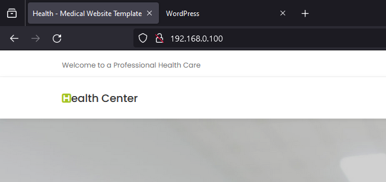

# Proyecto Vagrant - Automatización de Infraestructura (IaC)

## Descripción

El propósito de este proyecto es aplicar y demostrar los conocimientos adquiridos en Infrastructure as Code (IaC) mediante el uso de Vagrant para la gestión y automatización de entornos de desarrollo.

## Capturas de Pantalla

|                          |                                   |
|--------------------------|-----------------------------------|
|    | _Estructura de los directorios._ |
|             | _Demostración del VagrantFile._  |
|         | _Demostración de las VMs creadas._ |
|            | _Demostración de Wordpress desplegado._ |
|          | _Demostración de la Landing Page desplegada._ |

## Licencia

Este proyecto está bajo la Licencia MIT. Consulta el archivo [LICENSE](./LICENSE) para más detalles.
